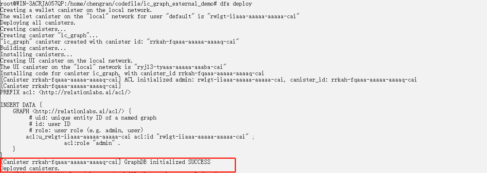

# **Relation Graph Developer Docs**

Dapp developers can deploy their own Relation Graph on the chain as a data storage service on the chain, and Dapp access Relation Graph for data storage and query..


We provide compiled wasm packages that developers can deploy directly on Internet Computer (IC). The Relation Graph SDK will be provided in the future to help Dapp developers better access Relation Graph services.


## Quick Start


We will demonstrate how to deploy IC Grph on Internet Computer (IC).

+ Install dfinity SDK on **Ubuntu system (version 20.04)** or **Mac system**, it is recommended to switch to **root user** and execute the following commands
    ```sh
    sh -ci "$(curl -fsSL https://sdk.dfinity.org/install.sh)"

    # check
    dfx  --version
    ```
+ Create a demo project
    ~~~sh
    dfx new --type=rust ic_graph_demo
    ~~~
+ Download the wasm package of ic_graph and the compressed file of the did file, decompress it and put it in the project root directory
    ~~~sh
        cd ic_graph_demo/
        curl -LJO https://storageapi.fleek.co/shadow-001-team-bucket/relationlabs/ic_graph.zip
        unzip ic_graph.zip
    ~~~
+ Find the dfx.json file in the project root directory, and replace the content of canisters with the following content
    ~~~json
        "canisters": {
            "ic_graph": {
                "type": "custom",
                "wasm": "ic_graph.wasm",
                "candid": "ic_graph.did"
            }
        }
    ~~~
    
+ Start dfx environment 
    ~~~sh
    dfx start --clean --background
    ~~~

    If you see the following information, it means the correct startup is successful:
    
+ Start project
    ~~~sh
    dfx deploy --no-wallet ic_graph
    ~~~

    If you see the following information, it means the correct startup is successful:
    

+ Store data
    Call the sparql_update method of ic_graph to store a user information
  ~~~sh
	dfx canister   call ic_graph sparql_update '("  
		INSERT DATA
		{ 
			:P1024 :name \"GraphDB\" ;
				:gender \"Male\" ;
				:age 30 ;
				:birthdate \"1992-03-19\"^^xsd:date ;
				:friends :P1 .
		}
	")'
  ~~~
  After the call is successful, SUCESS information will be returned:
  

+ Query data
   Call the sparql_query method of ic_graph to query all user information
  ~~~sh
	dfx canister   call ic_graph sparql_query '("tsv","
		SELECT * 
		WHERE {
			?s :name ?name;
				:age ?age ;
				:gender ?gender ;
				:birthdate ?birthdate.
		} 
	")'
  ~~~
  The call is successful and will return the data we just inserted:
  


# Relation Graph API


## 1. API overview

|   module   |    method        |       role of caller        |     remark  |
|   ---     |   ---             |       ---          |     ---     |
|   Authorize    |    acl_grant      |     admin          |   Admin authorizes other users|
|   Authorize    |   acl_show        |      admin         |   Admin view authorization list    |
|   Authorize    |   acl_revoke        |      admin         |   Admin remove authorized user    |
|   Data    |   sparql_update   |      admin / user    | Execute SparQL statements to process addition, deletion, and modification operations |
|   Data    |   sparql_query    |      all        | Execute SparQL statements to process query operations. *No permission check**|


## 2. Core API

### 2.1. Authorize
#### 2.1.1. acl_grant

The administrator of Relation Graph can authorize other users。

**Remarks**: We preset the deployer of Relation Graph as the initial administrator, who has the operation rights of all interfaces.

did：
~~~rust
service : {
    "acl_grant": (text, text) -> (text);
}
~~~
+ Request：
    - param0： the principal of the authorized user
    - param1： The role of the authorized user. The roles are currently divided into admin, user
+ Response：
    - SUCCESS: grant success
    - ACCESS_DENIED ： Call without permission
+ Request example ：
  ~~~sh
    dfx canister call ic_graph acl_grant '("g4lfy-u4kk4-vlixd-jufrl-7x2ro-myhu2-ptpz3-lx4vu-u5ruj-ohwvl-hqe","user")'
  ~~~

#### 2.1.2. acl_show

The admin of Relation Graph can view the current authorization list

did：
~~~rust
service : {
    "acl_show": (nat) -> (text) query;
}
~~~
+ Request：
    - param0: number of queries
+ Response：
    - Authorization list
+ Request example
  ~~~sh
    dfx canister call ic_graph acl_show '(10)'
  ~~~


#### 2.1.3. acl_revoke

The admin of Relation Graph can remove authorized user

did：
~~~rust
service : {
    "acl_revoke": (text) -> (text) query;
}
~~~
+ Request：
    - param0: the principal of the authorized user
+ Response：
    - SUCCESS: grant success
    - ACCESS_DENIED ： Call without permission
+ Request example
  ~~~sh
    dfx canister call ic_graph acl_show '("g4lfy-u4kk4-vlixd-jufrl-7x2ro-myhu2-ptpz3-lx4vu-u5ruj-ohwvl-hqe")'
  ~~~


### 2.2. Data

#### 2.2.1. sparql_update

Users with Relation Graph admin/user roles can perform data operations.

did：
~~~rust
service : {
    "sparql_update": (text) -> (text);
}
~~~
+ Request：
    - param0: SparQL statement to execute
+ Response：
    - SUCCESS: grant success
    - ACCESS_DENIED ： Call without permission
+ Request example:
  ~~~sh
    	dfx canister   call ic_graph sparql_update '("  
		INSERT DATA
		{ 
			:P1024 :name \"GraphDB\" ;
				:gender \"Male\" ;
				:age 30 ;
				:birthdate \"1992-03-19\"^^xsd:date ;
				:friends :P1 .
		}
	")'
  ~~~


#### 2.2.2. sparql_query

Query the data of Relation Graph without permission verification.

did：
~~~rust
service : {
    "sparql_query": (text, text) -> (text) query;
}
~~~
+ Request ：
    - param0： The data display form has the following enumeration values：
      -  tsv
      -  csv
      -  srj(json)
      -  srx(xml)
    - param1: SparQL statement to execute
+ Response：
    - query result
+ Request example: 
  ~~~sh
	dfx canister   call ic_graph sparql_query '("tsv","
		SELECT * 
		WHERE {
			?s :name ?name;
				:age ?age ;
				:gender ?gender ;
				:birthdate ?birthdate.
		} 
	")'
  ~~~


## 3. SparQL syntax description

We list common syntax examples:
### 3.1. Insert

1. Forms  
   ~~~sql
    INSERT DATA 
        { 
            :P2 :name "GraphDB" ;
                :friends :P1 . 
        } 
   ~~~
    + declared as insert data statement
      + INSERT DATA  
    + in {}, lists the instances and properties to be saved
    + triple format
      + :P2 :name "GraphDB" ; 
        + :P2   (Unique ID of the instance)
        + :name     (instance property name)
        + "GraphDB"     (instance property value)
    + end of semicolon
      + There are other attribute descriptions after the description
    + end of dot
      + Indicates the end of the instance description


### 3.2. Query

1. Forms   
   ~~~sql
	SELECT  DISTINCT * 
		WHERE {
			?s :name ?name;
				:age ?age ;
				:gender ?gender ;
				:birthdate ?birthdate.
		} 
        ORDER BY  DESC(?age)
        OFFSET 5
        limit 10
   ~~~
    + declared as a query
      + SELECT  
    + distinct
      + DISTINCT  
    +  There are two ways to write the attributes to be displayed
       +  “*” ： Refers to show all attributes found in {}
       +  ?name ?age Display the specified attribute
    +  in {}, lists the instances and properties to be displayed
    +  triple format
       +   ?s  (No specific instance specified)
       +   ：name  (property name)
       +   ?name  (property value)
    +  order
       +  ORDER BY  DESC(?age)   (Sort by age, note that the brackets are in the form of question marks)
    +  pagination
       +  OFFSET    
       +  limit   


### 3.3. Delete
  
1. Forms 
   ~~~sql  
    DELETE WHERE
        {
        :P1003 ?p ?o .
        }
   ~~~
   ~~~sql
    DELETE WHERE
        {
        :P1001 :age ?age.
        }

   ~~~
   + Declare a delete statement
     + DELETE  
   + {} lists the instances and properties to delete
   + triple format
     + :P1003 ?p ?o .  (delete all attributes of the instance)
       + :P1003 (Delete the entity uniquely identified as P1003)
       + ?p  (property name, use a question mark to indicate that no specific attribute is specified, then delete all attributes of the instance)
       + ?o  (property value)
     + :P1001 :age ?age. (Remove the age property of an instance)


### 3.4. Update

1. Forms
   ~~~sql
        DELETE
        { :P1001 :age ?o }
        INSERT
        { :P1001 :age 38 }
        WHERE
        { :P1001 :age ?o }
   ~~~


We list SPARQL usage examples in real scenarios in [Relation Graph Demo](/practice/), including combinations and extensions to basic statements.