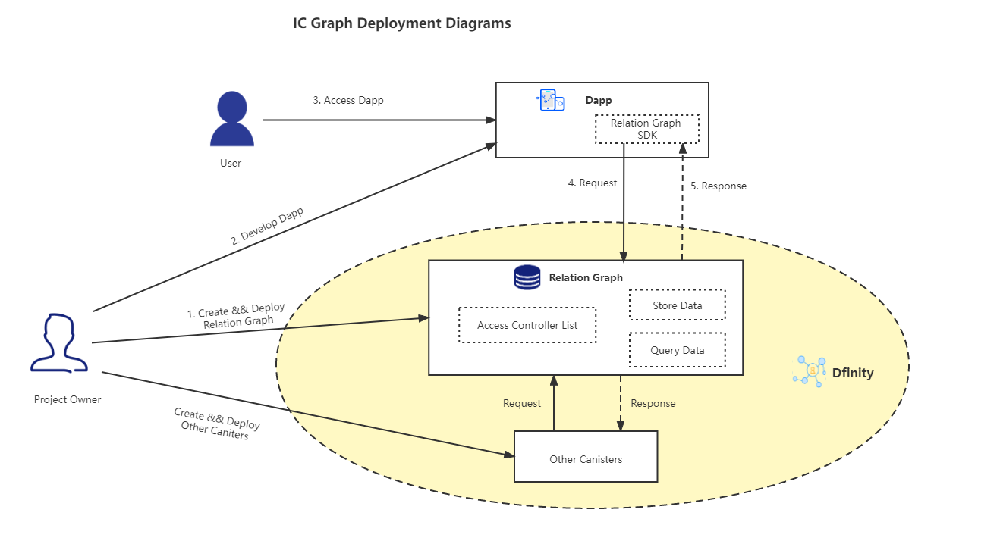

# Introduction to Relation Graph？

Relation Graph is a graph database implemented in Rust. It supports SPARQL query language and has the basic features of a database:

- supports Create, Read, Update, Delete operations for data management
- custom Schema
- Permission management

Dapp Developers can deploy their own Relation Graph on the blockchain and use it as a data storage service. Dapps will then be able to access and store data through the Relation Graph. 
   

We're providing a compiled wasm package, which can be deployed directly on Dfinity by developers. In the future, we will also provide Relation Graph SDK to help Dapp Developers access Relation Graph service.

