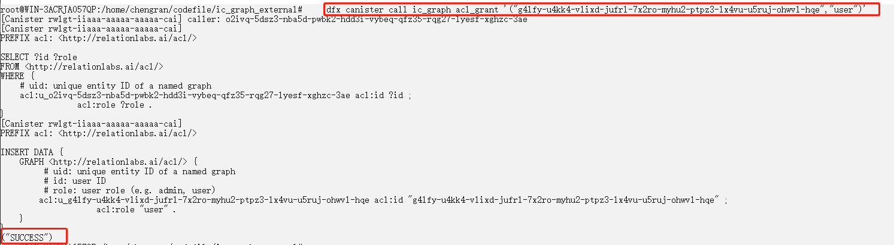
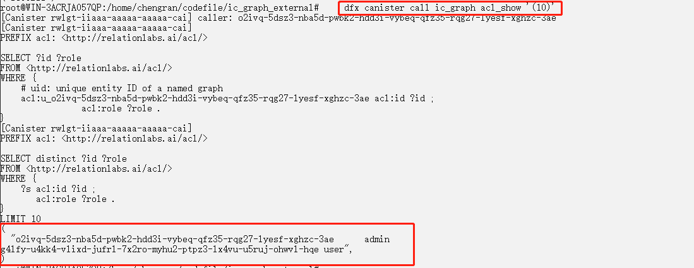
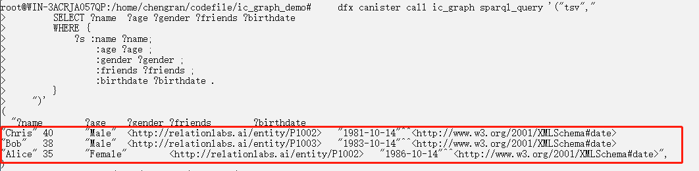
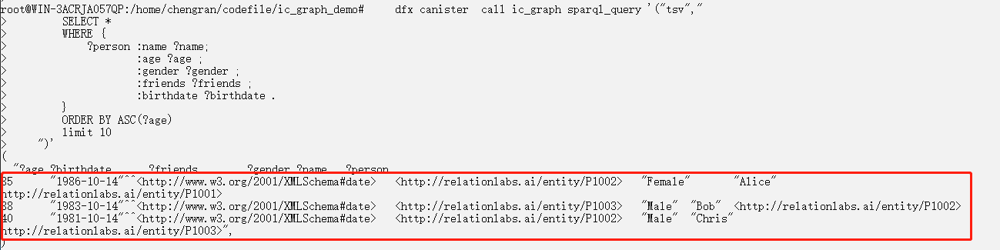
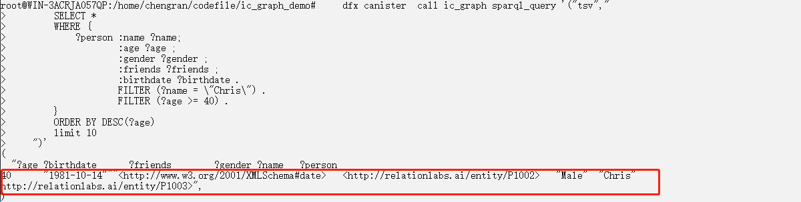
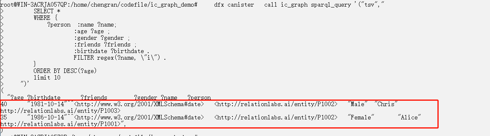
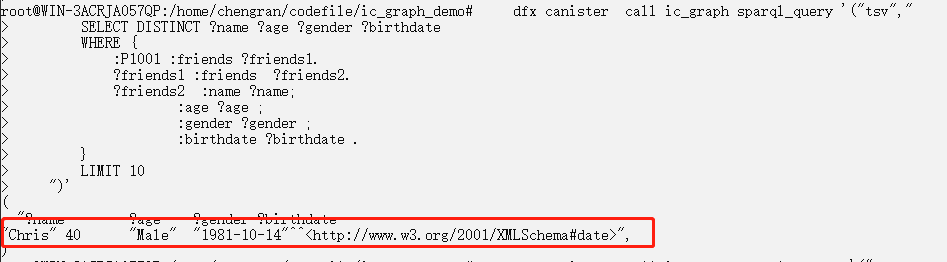
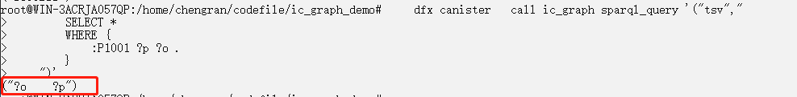

#  Best Practice

With Relation Graph, we can quickly develop basic applications such as contact lists or cloud notes.

## Demo for using graph data


We will demonstrate, on a local console, how to use two interfaces provided by Relation Graph, namely sparql_update and sparql_query, to manage user information and list of friends.

### ACL authorization

+ Authorize a user
    ```sh
    dfx canister call ic_graph acl_grant '("g4lfy-u4kk4-vlixd-jufrl-7x2ro-myhu2-ptpz3-lx4vu-u5ruj-ohwvl-hqe","user")'

    ```
    On success, "SUCCESS" will be returned:
    

+ Query authorized list
    ```sh
    dfx canister call ic_graph acl_show '(10)'

    ```
    The result returns as follows. The two users below can perform the sparql_update operation.
    


### Add new users

+ Add three new users and their property data. The relations among the three are as follows: P1001 --> P1002 <--> P1003
    ```sh
    dfx canister  call ic_graph sparql_update '("  
        INSERT DATA
        { 
            :P1001 :name \"Alice\" ;
                :gender \"Female\" ;
                :age 35 ;
                :birthdate \"1986-10-14\"^^xsd:date ;
                :friends :P1002 .
        }
    ")'

    dfx canister  call ic_graph sparql_update '("  
        INSERT DATA
        { 
            :P1002 :name \"Bob\" ;
                :gender \"Male\" ;
                :age 38 ;
                :birthdate \"1983-10-14\"^^xsd:date ;
                :friends :P1003 .
        }
    ")'

    dfx canister  call ic_graph sparql_update '("  
        INSERT DATA
        { 
            :P1003 :name \"Chris\" ;
                :gender \"Male\" ;
                :age 40 ;
                :birthdate \"1981-10-14\"^^xsd:date ;
                :friends :P1002 .
        }
    ")'

    ```
    On success, "SUCCESS" will be returned

+ Query the data saved in the step above

    ~~~sh
    dfx canister call ic_graph sparql_query '("tsv","
        SELECT ?name  ?age ?gender ?friends ?birthdate
        WHERE {
            ?s :name ?name;
                :age ?age ;
                :gender ?gender ;
                :friends ?friends ;
                :birthdate ?birthdate .
        } 
    ")'
    ~~~
    Query current data of all users in the database
    

### Query the list of users

In this example to query the list of users，we will demonstrate sorting, setting the number of records to be queried, and querying with multiple conditions :

+ Query the data, sort the result, and limit the number of records to be queried:
    ```sh
    dfx canister  call ic_graph sparql_query '("tsv","
        SELECT *
        WHERE {
            ?person :name ?name;
                    :age ?age ;
                    :gender ?gender ;
                    :friends ?friends ;
                    :birthdate ?birthdate .
        } 
        ORDER BY ASC(?age)
        limit 10
    ")'
    ```
    Display and sort the result according to age:
    

+ Query data and filter the result with multiple query conditions:
    ```sh
    dfx canister  call ic_graph sparql_query '("tsv","
        SELECT *
        WHERE {
            ?person :name ?name;
                    :age ?age ;
                    :gender ?gender ;
                    :friends ?friends ;
                    :birthdate ?birthdate .
                    FILTER (?name = \"Chris\") .
                    FILTER (?age >= 40) .
        } 
        ORDER BY DESC(?age)
        limit 10
    ")'
    ```
    Only query the results where the name is Chris and the age<=40:
    

+ Fuzzy query:
    ```sh
    dfx canister   call ic_graph sparql_query '("tsv","
        SELECT *
        WHERE {
            ?person  :name ?name;
                    :age ?age ;
                    :gender ?gender ;
                    :friends ?friends ;
                    :birthdate ?birthdate .
                    FILTER regex(?name, \"i\") .
        } 
        ORDER BY DESC(?age)
        limit 10
    ")'
    ```
    Results of users whose name contain the letter "i":
    


### Query the list of friends

In this example to query the list of friends, we focus on querying first degree and second degree relations.

+ Query a user's list of friends

  ~~~sh
    dfx canister   call ic_graph sparql_query '("tsv","
        SELECT DISTINCT ?name ?age ?gender ?birthdate
        WHERE {
            :P1001 :friends ?friends1.
            ?friends1  :name ?name;
                    :age ?age ;
                    :gender ?gender ;
                    :birthdate ?birthdate .
        }
        LIMIT 10
    ")'
  ~~~

+ Query a user's list of friends that satisfy second degree relations (the friends of friends), and perform duplicate elimination on the result.

    ~~~sh
    dfx canister  call ic_graph sparql_query '("tsv","
        SELECT DISTINCT ?name ?age ?gender ?birthdate
        WHERE {
            :P1001 :friends ?friends1.
            ?friends1 :friends  ?friends2.
            ?friends2  :name ?name;
                    :age ?age ;
                    :gender ?gender ;
                    :birthdate ?birthdate .
        }
        LIMIT 10
    ")'
    ~~~
    Since P1001's second degree friend is P1003, so P1003's data will be returned:
    


### Modify a user's information

+ Modify a user's age

    ```sh
    dfx canister  call ic_graph sparql_update '("  
        DELETE
        { :P1001 :age ?o }
        INSERT
        { :P1001 :age 38 }
        WHERE
        { :P1001 :age ?o }
    ")'
    ```

+ Check the result of the modification

    ~~~sh
    dfx canister  call ic_graph sparql_query '("tsv","
        SELECT ?age
        WHERE {
            :P1001 :name ?name;
                :age ?age ;
                :gender ?gender ;
                :friends ?friends ;
                :birthdate ?birthdate .
        } 
    ")'
    ~~~

### Delete a user

+ Delete some of the properties of the user P1001
    ```sh
    dfx canister  call ic_graph sparql_update '("
        DELETE WHERE
        {
        :P1001 :age ?age;
            :name ?name .
        }
    ")'
    ```

+ Delete all of the properties of the user P1003
    ```sh
    dfx canister  call ic_graph sparql_update '("  
        DELETE WHERE
        {
        :P1001 ?p ?o .
        }
    ")'
    ```


+ Check the result of deletion
    ```sh
    dfx canister   call ic_graph sparql_query '("tsv","
        SELECT *
        WHERE { 
            :P1001 ?p ?o .
        }
    ")'
    ```
    On success, the data will disappear from the query.
    

