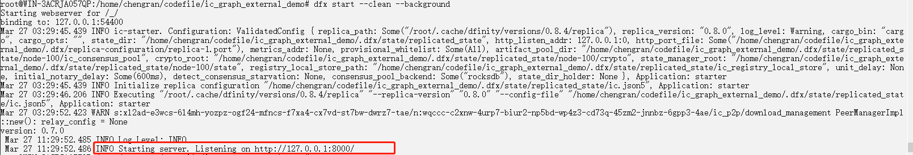
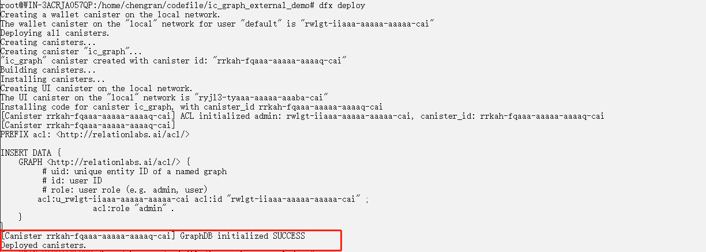
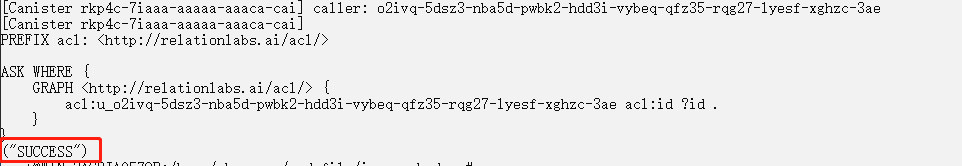
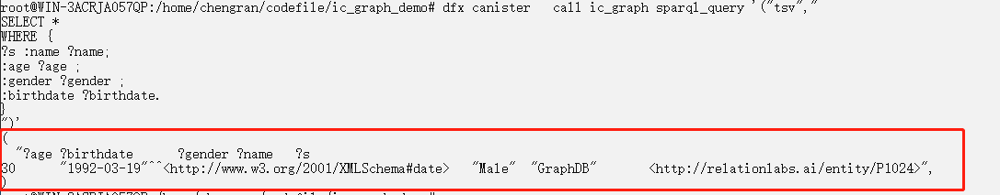
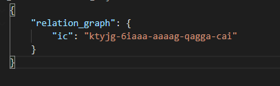

# Quick Start

Now, we will deploy Relation Graph service locally.

## Deploy the local service

1. Install Dfinity SDK

    Install Dfinity SDK on **Ubuntu Linux (20.04)** or **MacOS**, we recommend that you switch to the **root** user to execute the following command:
    ```sh
    sh -ci "$(curl -fsSL https://sdk.dfinity.org/install.sh)"

    # check if it is installed correctly
    dfx  --version
    ```
2. Create a demo project
    ~~~sh
    dfx new --type=rust relation_graph_demo
    ~~~
3. Configure the wasm package of Relation
   
   + Download the compressed file containing the wasm package and did file of relation_graph, unzip it, and then place it under the root directory of the project.
        ~~~sh
            cd relation_graph_demo/
            curl -LJO https://storageapi2.fleek.co/shadow-001-team-bucket/relationlabs/relation_graph_with_acl.zip
            unzip relation_graph_with_acl.zip
        ~~~
   + Locate dfx.json under the root directory of the project, then replace the content in the "canister" section with the following:
        ~~~json
            "canisters": {
                "relation_graph": {
                    "type": "custom",
                    "wasm": "relation_graph.wasm",
                    "candid": "relation_graph.did"
                }
            }
        ~~~
4. Start the relation_graph project
   + Start the dfx environment
        ~~~sh
        dfx start --clean --background
        ~~~

        On success, you will see the information below:
        
   + Start the project
       ~~~sh
       dfx deploy --no-wallet relation_graph
       ~~~

       On success, you will see the information below:
       

5. Call the interface of the service

   + Store data
    Call the sparql_update of Relation Graph to store a user's information
        ~~~sh
            dfx canister   call relation_graph sparql_update '("  
                INSERT DATA
                { 
                    :P1024 :name \"GraphDB\" ;
                        :gender \"Male\" ;
                        :age 30 ;
                        :birthdate \"1992-03-19\"^^xsd:date ;
                        :friends :P1 .
                }
            ")'
        ~~~
        On success, a "SUCCESS" message will return:
        

   + Query data
      Call the sparql_query method of Relation Graph to query all the users' information
     ~~~sh
        dfx canister   call relation_graph sparql_query '("tsv","
            SELECT * 
            WHERE {
                ?s :name ?name;
                    :age ?age ;
                    :gender ?gender ;
                    :birthdate ?birthdate.
            } 
        ")'
     ~~~
     On success, it will return the record inserted above.
     

    
    So far, we have quickly deployed a Relation Graph service locally and conducted data storage and query tasks via interfaces.


## Deploy on the IC mainnet

After finishing the local deployment in the step above, if we need to deploy a Relation Graph on IC's mainnet, we can continue with the following:

1. Create a canister on the mainnet
   
   ```sh
    # query your principal 
    dfx identity get-principal

    # Create a new canister with cycles by transferring ICP tokens from your ledger account by running a command similar to the following 
    # e.g. dfx ledger --network ic create-canister  djp6k-xiv5n-udf77-eaphw-iv6pr-u43dl-7wm3i-oa5xc-2mg6u-xuyko-fae --amount  0.1
    dfx ledger --network ic create-canister <controller-principal-identifier> --amount <icp-tokens>
    
   ```

2. Configure canister_ids.json
   
   Create a canister_ids.json under the root directory of the project with the following content：
   ```json
    {
        "relation_graph": {
            "ic": "${your canisterId}"
        }
    }
   ```
   

3. Deploy

    ```sh
    dfx deploy --network ic --no-wallet relation_graph
    ```

4. Call the Relation Graph on the mainnet

    attach --network ic parameter after the command "dfx canister" to specify accessing the canister interface on the mainnet.

   + Store data
        ~~~sh
            dfx canister --network ic  call relation_graph sparql_update '("  
                INSERT DATA
                { 
                    :P1024 :name \"GraphDB\" ;
                        :gender \"Male\" ;
                        :age 30 ;
                        :birthdate \"1992-03-19\"^^xsd:date ;
                        :friends :P1 .
                }
            ")'
        ~~~


   + Query data
     ~~~sh
        dfx canister  --network ic  call relation_graph sparql_query '("tsv","
            SELECT * 
            WHERE {
                ?s :name ?name;
                    :age ?age ;
                    :gender ?gender ;
                    :birthdate ?birthdate.
            } 
        ")'
     ~~~


## Video Demo

<iframe width="760" height="515" src="https://www.youtube.com/embed/N2Zx3WfqX_g" title="YouTube video player" frameborder="0" allow="accelerometer; autoplay; clipboard-write; encrypted-media; gyroscope; picture-in-picture" allowfullscreen></iframe>
