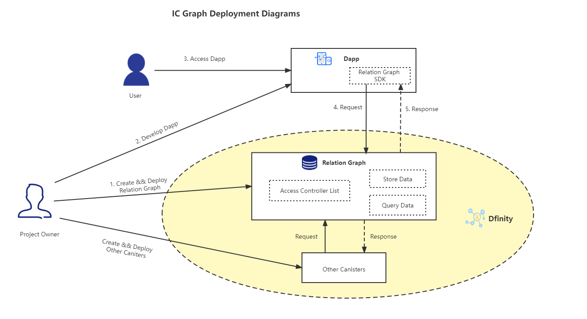

# 什么是Relation Graph？

Relation Graph 是基于rust实现的图数据库，支持SPARQL查询语句,具备数据库的基本特性：

- 对数据进行增、删、改、查
- 自定义Schema
- 权限管理

Dapp开发者可以在链上部署一个属于自己的Relation Graph，将其作为链上的数据存储服务，Dapp访问Relation Graph进行数据存储和查询。
   

我们提供了编译好的wasm包，开发者可以直接将其部署在Dfinity上。后续将提供Relation Graph SDK,帮助Dapp开发者更好的访问Relation Graph服务。

